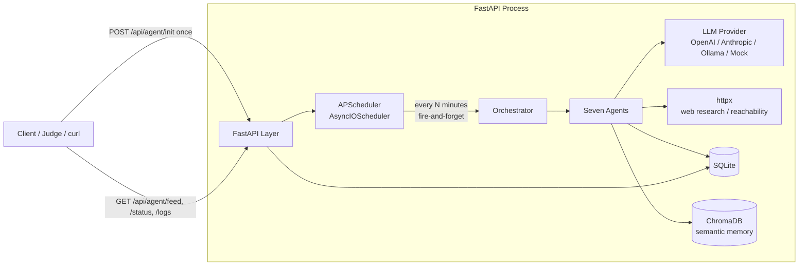
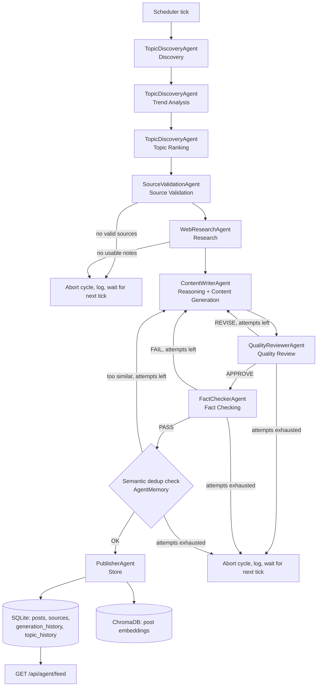
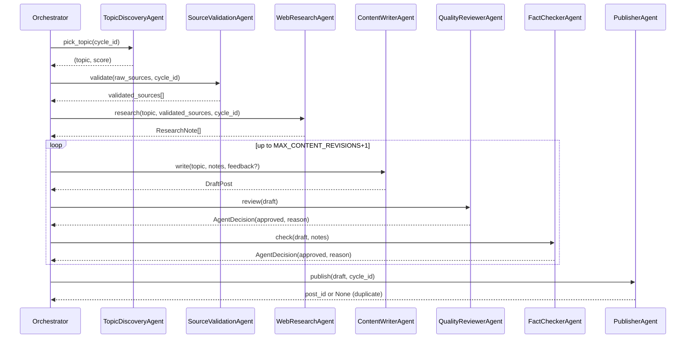
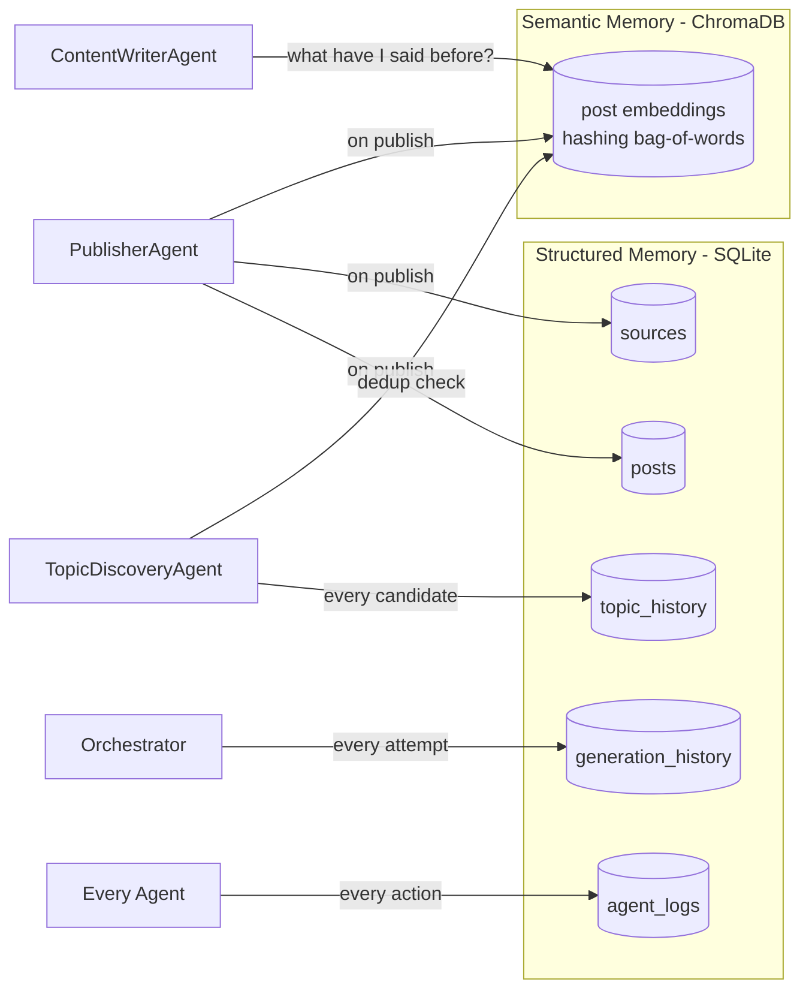
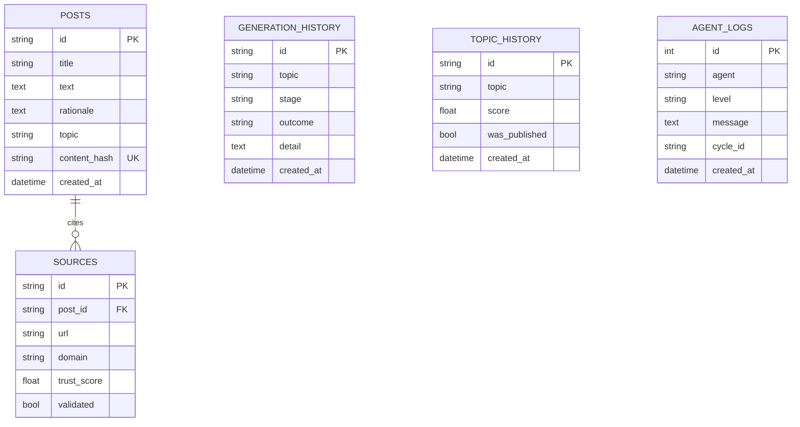

# Architecture

## 1. System context

`POST /api/agent/init` is the only request the system ever needs. It starts
the `AsyncIOScheduler` living inside the same asyncio event loop as the
FastAPI/uvicorn server, so background cycles keep firing for the lifetime of
the process — no cron, no external worker, no additional prompting.

## 2. Pipeline (the eight boxes from the spec, mapped to code)

Every "attempts left" branch is bounded by `MAX_CONTENT_REVISIONS` (default
2); once exhausted the cycle aborts cleanly and logs why, rather than
publishing something unverified or looping forever.

## 3. Agent communication

Agents never call each other directly. The Orchestrator passes a single
typed `PipelineContext` dataclass through each stage — this is the entire
"communication protocol": typed fields in, typed fields/decisions out. It
keeps every agent independently unit-testable (see `tests/test_agents.py`)
and swappable — e.g. replacing `WebResearchAgent`'s offline stub with a real
search-API-backed implementation touches exactly one file.

## 4. Memory model

- **Structured memory (SQLite)** is the system of record: what the API
  serves, what a judge can inspect directly with any SQLite browser.
- **Semantic memory (ChromaDB)** uses a small dependency-free hashing
  embedding function (see `app/vectorstore.py`) instead of Chroma's default
  model, specifically so the whole system — including near-duplicate
  detection — runs with **zero network access and zero model downloads**.
  Swapping in a real sentence-transformer or an OpenAI embeddings call is a
  one-line change if embedding quality matters more than offline guarantees
  in your deployment.

## 5. Data model (SQLite)

## 6. Retry & failure semantics

| Failure | Handled by | Behavior |
|---|---|---|
| LLM call throws | `utils/retry.retryable` | exponential backoff + jitter, up to N attempts, then `RetryExhaustedError` bubbles to caller |
| HTTP fetch/HEAD throws | `utils/retry.retryable` | same, used in `SourceValidationAgent`/`WebResearchAgent` |
| Draft fails review | `Orchestrator.run_cycle` | feedback fed back into `ContentWriterAgent`, bounded by `MAX_CONTENT_REVISIONS` |
| Draft fails fact-check | `Orchestrator.run_cycle` | same bounded revision loop |
| Draft too similar to prior post | `Orchestrator.run_cycle` | same bounded revision loop |
| Revisions exhausted | `Orchestrator.run_cycle` | cycle aborts, logged, **nothing published**, scheduler waits for next tick |
| No validated sources / no research notes | `Orchestrator.run_cycle` | cycle aborts early, logged as `abort` |
| Any uncaught exception in a cycle | `Orchestrator.run_cycle` top-level try/except | logged to `agent_logs` + `generation_history`, `cycles_failed` incremented, **scheduler itself is never killed** |
| Duplicate content | `PublisherAgent` (SHA-256 content hash) | rejected, logged, cycle ends without publishing |
| Vector memory (Chroma) unavailable | `VectorMemory` | fails open — dedup checks return "not similar", writer context returns empty; pipeline still runs |

## 7. Why this design scales beyond a hackathon demo

- Swapping `LLM_PROVIDER` or `RESEARCH_MODE` is a config change, not a code
  change — every agent depends only on the `LLMProvider` interface.
- Each agent is a small, independently testable class with one job; adding
  an eighth agent (e.g. an `ImageGeneratorAgent` for post thumbnails) means
  adding one file and one line in `Orchestrator.__init__`.
- The Orchestrator's control flow (aborts, revisions, top-level exception
  guard) is the only place cross-cutting reliability logic lives, so it's
  auditable in one file (`app/agents/orchestrator.py`) instead of scattered
  across seven agents.
